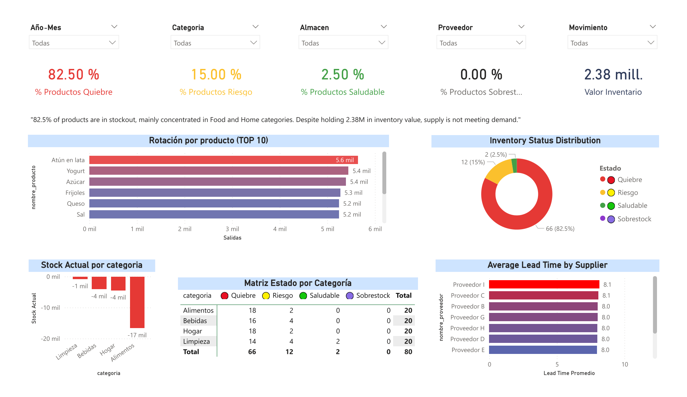
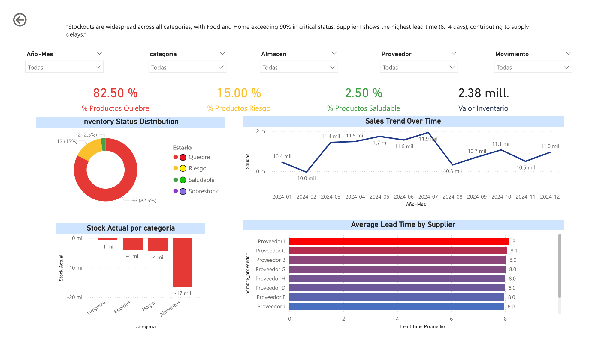
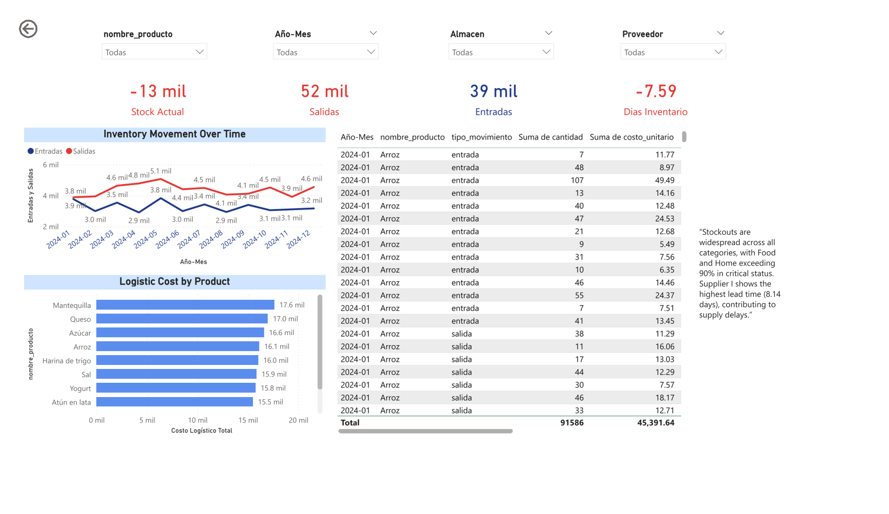

# NetLive - Supply Chain & Inventory Analytics

## 📊 Project Overview

This project analyzes inventory performance, product movement, and supplier efficiency using Power BI.

The objective is to identify stock imbalances, supply chain inefficiencies, and operational risks through data-driven insights.

---

## 🎯 Business Problem

Companies often struggle with stock shortages, overstock, and inefficient supplier performance.
This project simulates a real-world supply chain environment to analyze and improve inventory management.

---

## 🔄 End-to-End Process

1. Data generation using SQL (simulated supply chain dataset)
2. Data modeling and transformation
3. Analytical modeling using DAX
4. Interactive dashboard development in Power BI
5. Business insights for decision-making

---

## 🧱 Data Model

**Fact Table:**

* Inventory Movements

**Dimension Tables:**

* Products
* Suppliers
* Warehouses
* Calendar (Date)

---

## 📈 Key Features

* KPI indicators (Inventory health)
* Inventory status classification (Stockout, Risk, Healthy)
* Product rotation analysis
* Supplier lead time evaluation
* Logistic cost analysis
* Drillthrough for product-level insights

---

## 🧠 Key Insights

* 82.5% of products are in stockout condition
* Stockouts are concentrated in Food and Home categories (>90%)
* Supplier I has the highest lead time (8.14 days)
* Inventory value (~2.38M) is not aligned with demand

---

## 📊 Dashboard Preview

### Executive Overview

### Inventory Analysis

### Product Detail

---

## 🛠 Tools & Technologies

* Power BI
* DAX
* SQL

---

## 🚀 Business Value

This dashboard helps to:

* Identify stock shortages
* Improve demand and supply alignment
* Evaluate supplier performance
* Optimize logistics costs
* Support data-driven decision-making

---

## 📂 Project Structure

NetLive-SupplyChain-Analytics/
│
├── dataset.sql
├── NetLive.pbix
├── README.md
└── images/
├── executive-overview.png
├── inventory-analysis.png
├── product-detail.png

---

## 📌 Author

**Yerson Huaman Noriega**
